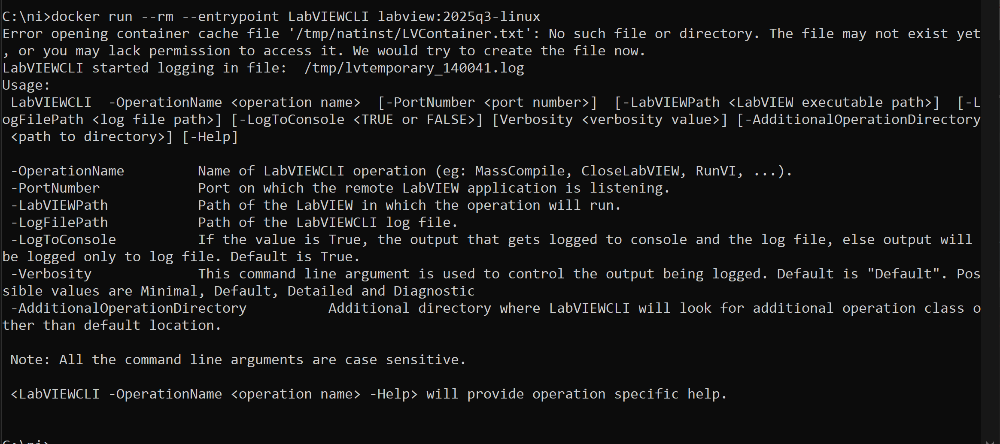

# Example Usages of LabVIEW Container
## Example Usage: LabVIEWCLI
### LabVIEWCLI: Run VI Analyzer Tests on VIs
Run Static code analysis on VIs using VI Analyzer Toolkit

**Use Command:**
```
    LabVIEWCLI
    -OperationName RunVIAnalyzer \
    -ConfigPath <Path to VI Analyzer config file> \
    -ReportPath <Location for saving the report> \
    -LabVIEWPath <Path to LabVIEW Executable>
```


### LabVIEWCLI: CreateComparisonReport
Create a diff report between two VIs

**Use Command:**
```bash
    LabVIEWCLI -OperationName CreateComparisonReport \
    -VI1 VINameOrPath1.vi \
    -VI2 VINameOrPath2.vi \
    -ReportType html \
    -ReportPath ReportPath.html
```


**Generated Report:**


### LabVIEWCLI: MassCompile VIs
MassCompile a Directory

**Use Command:**
```bash
    LabVIEWCLI -OperationName MassCompile -DirectoryToCompile <Directory to Compile> -LabVIEWPath <Path to LabVIEW Executable>
```


### LabVIEWCLI: RunVI
Run a specific VI on the system.

**Use Command:**
```bash
    LabVIEWCLI -OperationName RunVI -VIPath <Path to VI> -LabVIEWPath <Path to LabVIEW Executable>
```

For full details on all available LabVIEWCLI Commands, please find the official NI's LabVIEWCLI Documentation [here.](https://www.ni.com/docs/en-US/bundle/labview/page/predefined-command-line-operations.html?srsltid=AfmBOorqX__K-Rfh8JZCEho3PyoM75cXxBwij71DN5g89FPu6YoTZ7VQ)

## Example Usage: Change entrypoint of the container
By default, the LabVIEW container image does not define a default **CMD** or **ENTRYPOINT.**

The entrypoint of a container is the primary process that runs when the container starts — often referred to as PID 1.

Fortunately, Docker allows you to override the entrypoint at runtime using the `--entrypoint` flag.

You can launch the container with LabVIEWCLI as the main process like this:

```shell
docker run --rm --entrypoint LabVIEWCLI labview:2025q3-linux
```



This will start the container, run LabVIEWCLI, and then terminate the container once the CLI process exits.

### Why Use This?
- Perform a single CLI-driven task (e.g., mass compile, run a VI)
- Exit cleanly after completing that task
- Be used in CI/CD pipelines or automation scripts

## Example Usage: Mount Local Volumes
You can mount a local directory into the container using the `-v` (volume) flag.

Let's mount a local directory into the container and see the contents of a text file.

**Use Command:**
```shell
    docker run -it -v C:\ni:/mounted_directory labview:2025q3-linux
```


- `-v C:\ni:/mounted_directory` tells Docker to mount your local folder into `/mounted_directory `inside the container.
- The container will have read/write access to the mounted folder.

## Example Usage: Integration with CI/CD
The combination of the above usages along with automation tools like GitHub actions, Jenkins etc can unlock the true potential of LabVIEW in CI/CD Environments.


